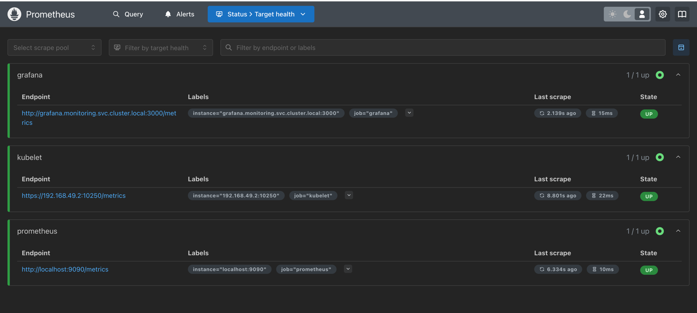

# Monitoring on Kubernetes
This repository uses Grafana and Monitoring tools to monitor metrics of the Kubernetes cluster. 

The Prometheus is already configured to collect metrics from Kubelet, Itself(that's right!) and Grafana metrics. 

The data of both services are persisted using PVCs.  

The permissions for Prometheus to access Kubelet metrics are configured through RBAC policies. 

## How to run on local? 
You'll need a K8s cluster and Kubectl access. Personally I use Minikube on local. 

1. Install and run Minikube
2. Install Kubectl and switch to `minikube` context. 
3. Apply all the files using `make apply`
4. Use `make forward` if you like Kubernetes to forward the ports of Grafana and Prometheus on your local machine. 

# How to see the status of metric collection?
To see the status of metrics being actively collected by Prometheus, visit address http://localhost:9090/targets
you should see three targets:
- Kubelet on port 10250(host ip configured in the Prometheus config map)
- Prometheus on port 9090
- Grafana on port 3000

### How to access the services from local browser?
There are two ways for this.
- Either use `minikube ip` to access the service ports. For this to work you need to run the service as is(With NodePort type)
- Or use port-forwarding the expose the service port on your local. This is only recommended for development environment and not for production.
  - Run `make forward`
  - Then open 'http://localhost:3000' for Grafana and 'http://localhost:9090' for Prometheus.

### How to visualize the data?
To visualize the collected metrics, you first need to add the Prometheus as a datasource to Grafana. This can be easily achieved using the internal DNS of Prometheus service, since both services are within one cluster.

1. Add a new datasource to Grafana with type Prometheus and address `http://prometheus.monitoring.svc.cluster.local:9090`
2. Open the datasource and click on `Import` to import pre-made visualizations from Grafana open-source library. 
   Suggested visualizations:
   - To monitor the PVCs: [Dashboard ID 13646](https://grafana.com/grafana/dashboards/13646-kubernetes-persistent-volumes)
   - Grafana metrics(from the default dashboards)
   - Prometheus 2.0 Stats(default)
   - Prometheus stats(default)
   - You can browse [Grafana library](https://grafana.com/grafana/dashboards/?search=prometheus&dataSource=prometheus) for more open source libraries